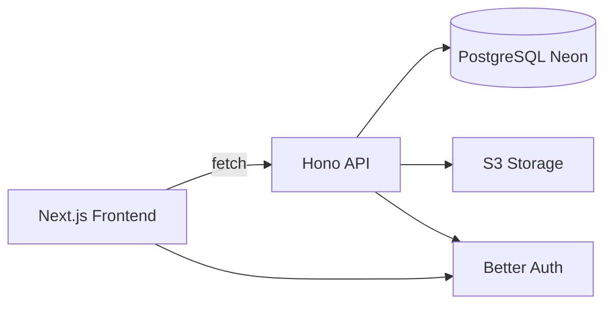

# Florence — Personal Health Event Tracker

## Overview

**Florence** is a privacy-first web application that allows users to store, organize, and track their personal healthcare information.

Users can create **Health Tracks** (e.g., "Blood Tests", "Back Pain", "Physiotherapy") and attach **events** such as doctor letters, test results, notes, and appointments — both past and future.

Florence empowers users to take ownership of their medical data in a clear, secure, and human way — without relying on hospital systems.

## Architecture



### Monorepo Structure

```
florence/
├── apps/
│   ├── web/          # Next.js frontend (App Router)
│   └── api/           # Hono API backend
├── packages/
│   ├── database/      # Prisma schema & client
│   └── types/          # Shared TypeScript types
└── about_project/     # Developer documentation
```

## Tech Stack

| Layer        | Technology          | Purpose                    |
| ------------ | ------------------- | -------------------------- |
| **Frontend** | Next.js (App Router) | Web app, forms, UI         |
|              | shadcn/ui + Tailwind | Component library & styling |
|              | React Hook Form + Zod | Form handling & validation |
| **Backend**  | Hono (TypeScript)   | API layer                  |
|              | Prisma ORM          | Database access            |
|              | PostgreSQL (Neon)   | Persistent storage          |
| **Auth**     | Better Auth         | Authentication & sessions   |
| **Storage**  | S3-compatible       | Document storage           |
| **Package Manager** | pnpm        | Monorepo management       |

## Quick Start

### Prerequisites

- Node.js 18+
- pnpm
- PostgreSQL database (Neon recommended)

### Setup

1. **Install dependencies:**

```bash
pnpm install
```

2. **Set up environment variables:**

```bash
# API
cp apps/api/.env.example apps/api/.env
# Edit apps/api/.env with your DATABASE_URL

# Database
cp packages/database/.env.example packages/database/.env
# Edit packages/database/.env with your DATABASE_URL
```

3. **Set up database:**

```bash
cd packages/database
pnpm db:sync  # Push schema, generate client, seed data
```

4. **Start development servers:**

```bash
# Terminal 1: API server
cd apps/api
pnpm dev  # Runs on http://localhost:8787

# Terminal 2: Web app
cd apps/web
pnpm dev  # Runs on http://localhost:3000
```

## Security & Privacy

- **Encryption:** TLS in transit, PostgreSQL encryption at rest
- **Access control:** Per-user ownership enforced via middleware (`userScopeGuard`)
- **File access:** Presigned URLs for uploads/downloads (no public access)
- **Compliance:** Aligned with GDPR principles
- **Data residency:** Hosted in UK or EU regions

## Documentation

For detailed documentation, see [`about_project/README.md`](about_project/README.md):

- **[API Documentation](about_project/api/README.md)** - Endpoints, testing, conventions
- **[Web Documentation](about_project/web/README.md)** - Routes, components, flows
- **[Database & Packages](about_project/packages/PRISMA_WORKFLOW.md)** - Prisma workflow, seeding
- **[Security & Compliance](about_project/compliance/document_data_compliance.md)** - Data protection, GDPR

## Development

### Common Commands

```bash
# Lint all packages
pnpm lint

# Type check all packages
pnpm typecheck

# Run tests
pnpm test

# Database operations (from packages/database/)
pnpm db:sync      # Push schema + generate + seed
pnpm db:push      # Push schema changes
pnpm db:generate  # Regenerate Prisma client
pnpm db:seed      # Seed test data
```

### Project Conventions

- **TDD:** Write tests first, then implement
- **Component structure:** Each component has `index.tsx`, `helpers.ts`, `types.ts`, `test/`
- **API routes:** User-scoped pattern `/api/users/:userId/*` (enforced by middleware)
- **Web routes:** User-scoped pattern `/[userId]/...`
- **Code style:** Standard.js rules, single quotes, functional patterns

See [`about_project/README.md`](about_project/README.md) for full conventions and workflows.

## Contributing

1. Read [`about_project/README.md`](about_project/README.md) for architecture and conventions
2. Follow TDD: write tests first
3. Update documentation when adding/modifying features
4. Keep code and docs aligned (code is source of truth)

## License

[Add license information]
