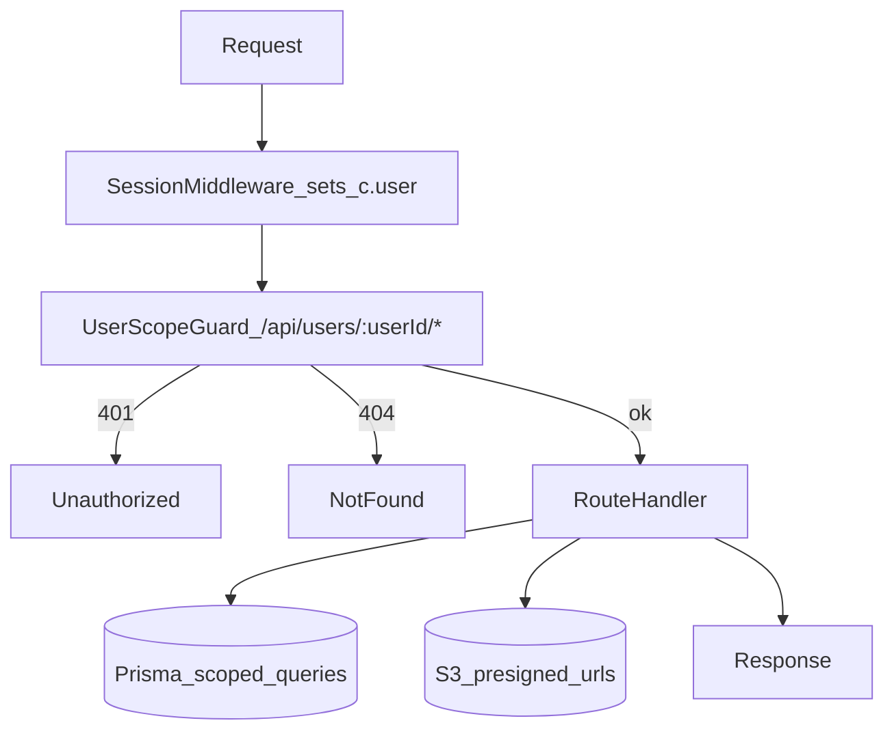

# API Endpoints Reference

## Overview

All user-scoped endpoints follow the pattern `/api/users/:userId/*` and are protected by `userScopeGuard` middleware, which enforces authentication and ownership.

## Base URL

- **Development:** `http://localhost:8787`
- **Production:** TBD

## Request Pipeline



## Authentication & Authorization

### Auth Flow

1. User signs up/signs in via Better Auth (`/api/auth/*`)
2. Session middleware extracts user from cookies (sets `c.get('user')`)
3. `userScopeGuard` middleware checks:
   - No session → `401 Unauthorized`
   - `userId` param ≠ authenticated user ID → `404 Not found` (hides resource existence)
   - Match → proceed to handler

### Better Auth Endpoints

- `POST /api/auth/sign-up` - Create account
- `POST /api/auth/sign-in` - Sign in
- `POST /api/auth/sign-out` - Sign out
- `GET /api/auth/session` - Get current session

See [Better Auth docs](https://better-auth.com) for details.

## Endpoint Groups

### Users

#### GET /api/users/:userId

Get user profile with tracks.

**Auth:** Required (middleware enforces `userId` match)

**Response:**

```json
{
  "success": true,
  "data": {
    "id": "user-id",
    "name": "User Name",
    "email": "user@example.com",
    "tracks": [...]
  }
}
```

#### GET /api/users/:userId/appointments/upcoming

Get upcoming appointments for user.

**Auth:** Required

**Query:** `limit` (optional, default: 3)

#### GET /api/users/:userId/hub/notifications

Get hub notifications for user.

**Auth:** Required

#### POST /api/users/:userId/hub/notifications/dismiss

Dismiss a hub notification.

**Auth:** Required

**Body:** `{ "type": "...", "entityId": "..." }`

### Tracks

#### GET /api/users/:userId/tracks/:slug

Get track metadata by slug.

**Auth:** Required

**Response:**

```json
{
  "success": true,
  "data": {
    "id": "track-id",
    "title": "Sleep",
    "slug": "sleep",
    "description": "...",
    "createdAt": "...",
    "updatedAt": "..."
  }
}
```

#### POST /api/users/:userId/tracks

Create a new health track.

**Auth:** Required

**Body:**

```json
{
  "title": "Sleep",
  "description": "Optional description"
}
```

**Response (201):**

```json
{
  "success": true,
  "data": {
    "id": "track-id",
    "title": "Sleep",
    "slug": "sleep",
    "description": "...",
    "createdAt": "...",
    "updatedAt": "..."
  }
}
```

**Slug Generation:** Auto-generated from title (lowercase, hyphenated, unique per user)

### Events

#### GET /api/users/:userId/tracks/:slug/events

List events for a track.

**Auth:** Required

**Query:**

- `limit` (optional, default: 100)
- `sort` (optional, `desc` or `asc`, default: `desc`)

**Response:**

```json
{
  "success": true,
  "data": [
    {
      "id": "event-id",
      "trackId": "track-id",
      "date": "2025-10-21T14:30:00.000Z",
      "type": "NOTE",
      "title": "Event Title",
      "notes": "...",
      "fileUrl": "https://...", // Presigned URL
      "createdAt": "...",
      "updatedAt": "..."
    }
  ]
}
```

#### POST /api/users/:userId/tracks/:slug/events

Create a new event.

**Auth:** Required

**Body:**

```json
{
  "title": "Event Title",
  "type": "NOTE",
  "date": "2025-10-21T14:30:00.000Z",
  "notes": "Optional notes",
  "symptomType": "headache", // Optional, for SYMPTOM type
  "severity": 5 // Optional, 1-10, for SYMPTOM type
}
```

**Event Types:** `NOTE`, `APPOINTMENT`, `RESULT`, `LETTER`, `FEELING`, `EXERCISE`, `SYMPTOM`

#### GET /api/users/:userId/tracks/:slug/events/:eventId

Get a specific event.

**Auth:** Required

#### PATCH /api/users/:userId/tracks/:slug/events/:eventId

Update event title and/or notes.

**Auth:** Required

**Body:**

```json
{
  "title": "Updated Title", // Optional
  "notes": "Updated notes" // Optional, null to clear
}
```

#### DELETE /api/users/:userId/tracks/:slug/events/:eventId

Delete an event and its attachment (if any).

**Auth:** Required

**Response:**

```json
{
  "success": true
}
```

#### DELETE /api/users/:userId/tracks/:slug/events/:eventId/attachment

Delete event attachment (keeps event).

**Auth:** Required

**Response:**

```json
{
  "success": true,
  "data": {
    /* updated event */
  }
}
```

### Document Upload

#### POST /api/users/:userId/tracks/:slug/events/:eventId/upload-url

Get presigned S3 URL for direct upload.

**Auth:** Required

**Body:**

```json
{
  "fileName": "report.pdf",
  "contentType": "application/pdf",
  "size": 123456
}
```

**Allowed Content Types:**

- `application/pdf`
- `image/jpeg`, `image/png`, `image/gif`, `image/webp`
- `application/msword`, `application/vnd.openxmlformats-officedocument.wordprocessingml.document`
- `text/plain`

**Max Size:** 10 MB

**Response:**

```json
{
  "success": true,
  "data": {
    "uploadUrl": "https://s3...", // Presigned PUT URL (15 min expiry)
    "fileUrl": "https://s3...", // Canonical S3 URL
    "key": "events/event-id/...",
    "expiresAt": "...",
    "maxSize": 10485760,
    "allowedContentTypes": [...]
  }
}
```

#### POST /api/users/:userId/tracks/:slug/events/:eventId/upload-confirm

Confirm upload and attach document to event.

**Auth:** Required

**Body:**

```json
{
  "fileUrl": "https://s3...",
  "key": "events/event-id/..."
}
```

**Response:**

```json
{
  "success": true,
  "data": {
    "id": "event-id",
    "fileUrl": "https://s3...", // Presigned GET URL (1 hour expiry)
    ...
  }
}
```

**Upload Flow:**

1. Call `upload-url` → get presigned PUT URL
2. Upload file directly to S3 using presigned URL
3. Call `upload-confirm` → attach to event
4. Event reads return presigned GET URLs (1 hour expiry)

## Response Format

All endpoints return:

```typescript
{
  success: boolean
  data?: T
  error?: string
}
```

## Error Responses

### 400 Bad Request

Validation errors:

```json
{
  "success": false,
  "error": "Title is required and must be a non-empty string"
}
```

### 401 Unauthorized

No session or invalid session:

```json
{
  "success": false,
  "error": "Unauthorized"
}
```

### 404 Not Found

Resource not found or `userId` mismatch:

```json
{
  "success": false,
  "error": "Not found"
}
```

### 500 Internal Server Error

Server error:

```json
{
  "success": false,
  "error": "Database connection failed"
}
```

## Testing

See [`TEST_API.md`](./TEST_API.md) for testing guide.

For endpoint examples, see test files in:

- `apps/api/src/routes/tracks/tests/`
- `apps/api/src/routes/events/tests/`
- `apps/api/src/routes/uploads/tests/`
- `apps/api/src/routes/user/tests/`

## See Also

- [API Overview](./README.md)
- [Testing Guide](./TEST_API.md)
- [Root README](../../README.md)
