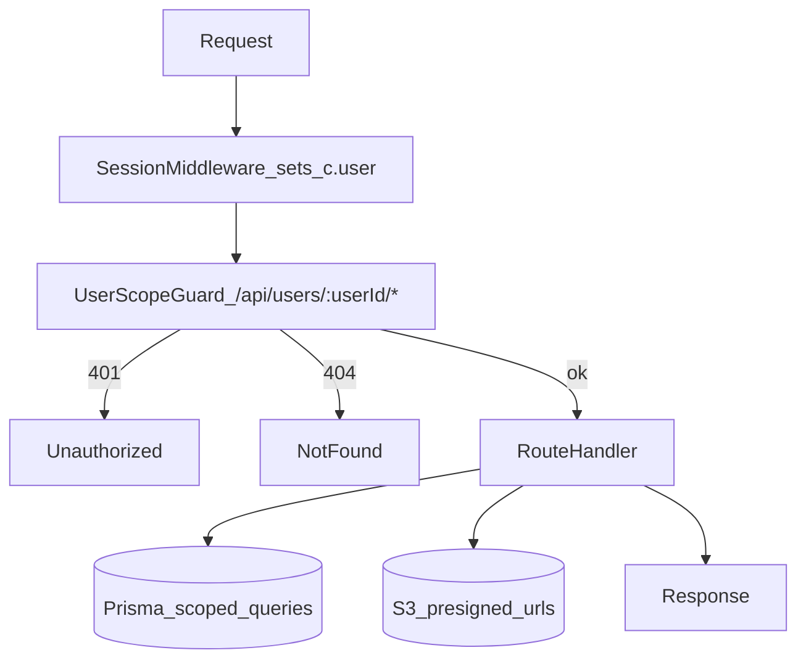

# API Documentation

## Overview

Florence API is built with Hono (TypeScript) and follows a user-scoped routing pattern. All user resources are accessed via `/api/users/:userId/*` routes, which enforce authentication and ownership via middleware.

## Quick Links

- [API Endpoints](./ENDPOINTS.md) - Complete endpoint reference
- [API Testing](./TEST_API.md) - Testing guide

## Architecture

### Request Pipeline

All requests flow through this pipeline:



### Authentication & Authorization

- **Session middleware** extracts user from Better Auth cookies (sets `c.get('user')`).
- **User scope guard** (`userScopeGuard`) enforces:
  - No session → `401 Unauthorized`
  - Session user ID ≠ `:userId` param → `404 Not found` (hides resource existence)
  - Match → proceed to handler

### Route Structure

All user-scoped routes follow this pattern:

```
/api/users/:userId/tracks/:slug/events/:eventId
```

- `:userId` - Authenticated user ID (enforced by middleware)
- `:slug` - Track slug (unique per user)
- `:eventId` - Event ID

## Endpoint Groups

- **Users**: `/api/users/:userId` - User profile and data
- **Tracks**: `/api/users/:userId/tracks` - Health track CRUD
- **Events**: `/api/users/:userId/tracks/:slug/events` - Event CRUD
- **Uploads**: `/api/users/:userId/tracks/:slug/events/:eventId/upload-*` - Document upload

## Response Format

All endpoints return a consistent format:

```typescript
{
  success: boolean
  data?: T
  error?: string
}
```

## Error Handling

- `400` - Bad request (validation errors)
- `401` - Unauthorized (no session)
- `404` - Not found (resource doesn't exist or wrong user)
- `500` - Internal server error

## See Also

- [API Endpoints Reference](./ENDPOINTS.md)
- [Testing Guide](./TEST_API.md)
- [Root README](../../README.md)

