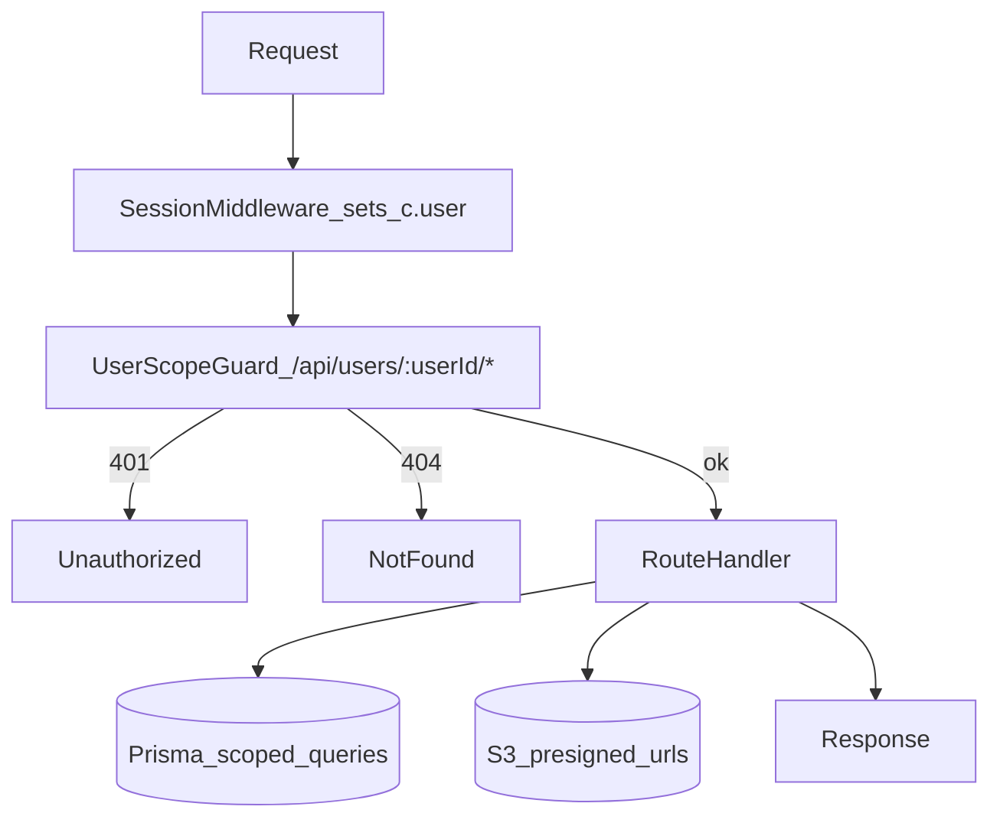

# Document Upload & Data Compliance Assessment

## Scope

This document assesses the security and data‑protection properties of the **event document upload and viewing flow** (S3 + presigned URLs) against the internal rules defined in `.cursor/rules/data-complaince.mdc`.

It focuses on:

- S3 bucket usage and presigned URLs
- API access control for events and documents
- Encryption, logging, and IAM considerations
- GDPR‑related obligations at a high level

---

## 1. "Store files in a bucket (S3, GCS) with access tokens + signed URLs only"

### Current Design

- Event documents are stored in a **private** S3 bucket.
- Browser never sees AWS credentials; it only:
  - Calls `POST /api/users/:userId/tracks/:slug/events/:eventId/upload-url` to obtain a **presigned PUT** URL (**15 min** expiry).
  - Uploads directly to S3 using that presigned URL.
- The database stores a **canonical S3 object URL** as `fileUrl` (via `getEventDocumentUrl(key)`).
- All **event read paths** now:
  - Extract the S3 key from this canonical URL.
  - Convert it to a **time‑limited presigned GET URL** using `getPresignedDownloadUrl(key)` (1‑hour default) before returning it in API responses.
- Upload requests are validated:
  - `contentType` is restricted to an allow‑list (`ALLOWED_CONTENT_TYPES`).
  - `size` is capped (`MAX_FILE_SIZE_BYTES`, currently 10MB).
- Upload confirmation (`POST /api/users/:userId/tracks/:slug/events/:eventId/upload-confirm`) verifies the object exists in S3 (`HeadObject`) before persisting `fileUrl`.

### Assessment

- **Compliant** with the rule "Store files in a bucket with access tokens + signed URLs only".
- The application never exposes public S3 URLs which rely on public bucket ACLs; all access is mediated via presigned URLs.

✅ **Status:** Aligned and secure by design for S3 access.

---

## 2. Encryption in Transit and at Rest

### In Transit

- **Browser → Web / API:** Assumes HTTPS termination (e.g. Vercel / reverse proxy); this meets "TLS 1.2+" when properly configured at the platform level.
- **API → S3:** AWS SDK uses HTTPS endpoints by default.

### At Rest

- S3 can provide **AES‑256 encryption at rest** (`SSE-S3`) or **KMS‑backed encryption** (`SSE-KMS`).
- The code does not explicitly enforce encryption per request; instead, this should be configured as:
  - **Default encryption enabled on the S3 bucket**.
  - Optionally enforced via bucket policy (reject unencrypted PUTs).

### Assessment

- In‑transit encryption is supported by the architecture; enforcement is a deployment concern.
- At‑rest encryption is likely fine _if_ S3 default encryption is enabled; this is not encoded in code and must be confirmed in infra.

⚠️ **Status:** Architecturally compatible, but requires **explicit S3 bucket configuration** to be fully compliant.

---

## 3. "No Staff Access to User Files Unless Explicitly Authorised" & Basic Access Logging

### Current State

- Code assumes an app‑level IAM principal with write/read access to the S3 bucket.
- There is no explicit documentation for:
  - Fine‑grained IAM policies (who can access the bucket).
  - S3 access logs / CloudTrail for object access.
  - Application‑level audit logs recording who viewed which document.

### Gaps & Recommendations

To match the rule:

- **IAM Hardening**
  - Ensure only:
    - The application role can read/write to the bucket.
    - Any operations role access is minimal and auditable.
  - Avoid broad wildcards (e.g. `s3:*` on `*` resources).
- **Logging**
  - Enable S3 access logs and/or CloudTrail for object GET/PUT.
  - Implement app‑level audit logging for document viewing, e.g.:
    - `userId`, `trackSlug`, `eventId`, timestamp, action (`view_document`).

### Assessment

- The S3 + presigned URL model is good, but **authorization and auditability** are not fully addressed yet.

⚠️ **Status:** Needs IAM tightening and explicit logging to be fully compliant.

---

## 4. "Build Backend with Future NHS/FHIR Integration in Mind" & User‑Scoped Encryption Keys

### Current State

- S3 keys are **event‑scoped**, e.g.:
  - `events/{eventId}/{timestamp}-{random}-{normalizedName}.{ext}`
- No per‑user encryption keys (e.g. per‑user KMS CMKs) are currently used.
- Ownership is modeled via events belonging to tracks, and tracks to users, in the DB layer.

### Assessment

- For the current MVP, the model is acceptable.
- For stricter future compliance and multi‑tenant needs:
  - Consider **per‑user or per‑tenant prefixes**, e.g. `users/{userId}/events/...`.
  - Plan a **KMS key strategy** supporting user‑ or tenant‑scoped keys.

⚠️ **Status:** Acceptable for now, but **user‑scoped keys are not implemented**; this should be captured as a future enhancement.

---

## 5. Metadata vs File Contents

### Current Design

- Event metadata (`title`, `description`, `date`, `type`, etc.) is stored in the database via Prisma.
- Only the **canonical S3 URL** is stored as `fileUrl`.
- File contents live **exclusively** in the S3 bucket.

### Assessment

- This clean separation between metadata and blob storage aligns with:
  - "Store metadata separately (e.g., title, date, tags)"
  - Keep DB payloads small and manageable.

✅ **Status:** Compliant with the metadata separation requirement.

---

## 6. Access Control on Read Endpoints

### Current Implementation

- All user-scoped endpoints (`/api/users/:userId/*`) are protected by `userScopeGuard` middleware:
  - **Authentication required:** No session → `401 Unauthorized`
  - **Ownership enforced:** `userId` param ≠ authenticated user ID → `404 Not found` (hides resource existence)
- Upload endpoints are user-scoped and enforce ownership:
  - `POST /api/users/:userId/tracks/:slug/events/:eventId/upload-url`
  - `POST /api/users/:userId/tracks/:slug/events/:eventId/upload-confirm`
- All track/event endpoints require authentication and enforce ownership:
  - `GET /api/users/:userId/tracks/:slug`
  - `GET /api/users/:userId/tracks/:slug/events`
  - `GET /api/users/:userId/tracks/:slug/events/:eventId`
  - `PATCH /api/users/:userId/tracks/:slug/events/:eventId`
  - `DELETE /api/users/:userId/tracks/:slug/events/:eventId`
  - `DELETE /api/users/:userId/tracks/:slug/events/:eventId/attachment`

### Request Pipeline

### Assessment

✅ **Status:** **Compliant** — authentication and ownership enforcement are implemented via `userScopeGuard` middleware for all user-scoped endpoints, including uploads.

---

## 7. GDPR Basics: Consent, Deletion, Export, Retention, DPIA

These requirements are **broader than the upload flow** but must be met at product level:

- **Explicit user consent** for storing health data.
- **Privacy Policy** and **Terms of Use**:
  - Clear, plain language, including how documents are stored and processed.
- **Account + data deletion:**
  - End‑to‑end deletion pipeline that removes:
    - User accounts.
    - Tracks and events.
    - Associated S3 objects (documents).
  - Note: there is **partial** document deletion today at the event level:
    - Deleting an event attempts to delete its S3 object (best‑effort).
    - Deleting an attachment deletes the S3 object and clears `fileUrl`.
- **Data export:**
  - Endpoint or flow to **download all user data**, including:
    - Events and tracks (JSON/CSV).
    - Uploaded documents (download bundle/links).
- **Retention policy:**
  - Automatic deletion (e.g. 30 days after account deletion) enforced both in DB and S3.
- **Light DPIA:**
  - Documented data protection impact assessment (non‑code artefact) covering:
    - Data types (health documents).
    - Risks.
    - Mitigations (private S3, presigned URLs, auth, logging).

### Assessment

- The current upload flow is compatible with these requirements, but **does not provide them alone**.
- Implementing these features will require additional endpoints, UI flows, and policies.

⚠️ **Status:** Product‑wide **work still required** for full GDPR alignment.

---

## Overall Compliance Snapshot

- **S3 design & presigned URLs:** ✅ Good, aligns with "bucket + signed URLs only".
- **Encryption:** ⚠️ Architecturally sound; must ensure bucket default encryption + HTTPS enforcement in deployment.
- **IAM & logging:** ⚠️ Needs explicit configuration and audit strategy.
- **Access control (reads + mutations + uploads):** ✅ All user-scoped endpoints require authentication and enforce ownership via `userScopeGuard` middleware.
- **GDPR‑level obligations (consent, deletion, export, retention, DPIA):** ⚠️ Not yet fully implemented; outside the upload flow but required for overall compliance.

### Conclusion

The **document upload and viewing architecture is secure in terms of S3 usage** and follows best practices (private bucket + presigned URLs).  
To comply with `.cursor/rules/data-complaince.mdc`, you must:

1. ✅ ~~**Lock down track/event endpoints (read + mutation + uploads)**~~ — **COMPLETED** via `userScopeGuard` middleware
2. **Ensure S3 encryption at rest** is enabled and documented.
3. **Harden IAM and add access/audit logging.**
4. Implement the **GDPR‑level features** (consent, deletion, export, retention, DPIA) at the product level.

## See Also

- [API Endpoints](../api/ENDPOINTS.md)
- [Document Upload Flow](../web/UPLOAD_DOCUMENT_FLOW.md)
- [Root README](../../README.md)

