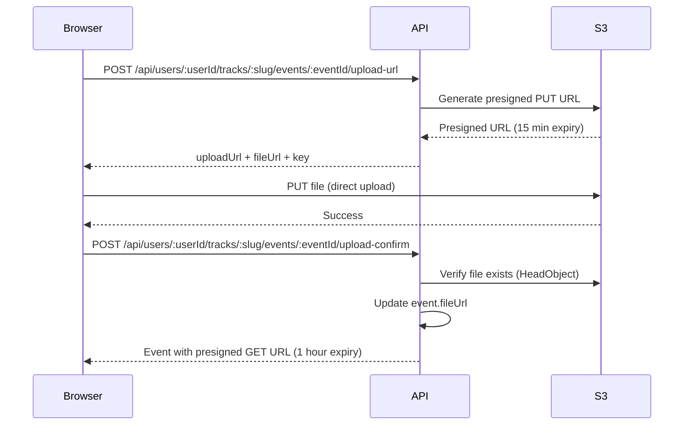

# Document Upload Flow

## Overview

Event documents are uploaded directly to S3 using presigned URLs. The flow ensures secure, private storage with no public access.

## Upload Sequence



## Components

### UploadDocument Component

**Location:** `apps/web/src/components/upload_document/index.tsx`

- Modal dialog for file selection
- Uses `useEventUpload` hook for upload orchestration
- Enforces file validation (type, size)

### useEventUpload Hook

**Location:** `apps/web/src/hooks/use_event_upload/index.ts`

**State:**
- `status`: `idle | getting-url | uploading | confirming | success | error`
- `error`: Error message

**API:**
- `upload({ eventId, file })` - Orchestrates upload flow

**Flow:**
1. Get presigned URL from server action
2. Upload file directly to S3
3. Confirm upload with API

## Server Actions

**Location:** `apps/web/src/app/[userId]/tracks/[trackSlug]/[eventId]/actions.ts`

### createEventUploadIntentAction

Gets presigned S3 PUT URL for direct upload.

**API:** `POST /api/users/:userId/tracks/:slug/events/:eventId/upload-url`

**Body:**
```json
{
  "fileName": "report.pdf",
  "contentType": "application/pdf",
  "size": 123456
}
```

**Response:**
```json
{
  "success": true,
  "data": {
    "uploadUrl": "https://s3...", // Presigned PUT (15 min)
    "fileUrl": "https://s3...", // Canonical URL
    "key": "events/event-id/...",
    "expiresAt": "...",
    "maxSize": 10485760,
    "allowedContentTypes": [...]
  }
}
```

### confirmEventUploadAction

Confirms upload and attaches document to event.

**API:** `POST /api/users/:userId/tracks/:slug/events/:eventId/upload-confirm`

**Body:**
```json
{
  "fileUrl": "https://s3...",
  "key": "events/event-id/..."
}
```

**Response:**
```json
{
  "success": true,
  "data": {
    "id": "event-id",
    "fileUrl": "https://s3...", // Presigned GET (1 hour)
    ...
  }
}
```

## API Endpoints

### POST /api/users/:userId/tracks/:slug/events/:eventId/upload-url

**Auth:** Required (middleware enforces `userId` match)

**Validation:**
- `fileName`: Required, non-empty string
- `contentType`: Must be in allowed list
- `size`: Must be positive, max 10 MB

**Allowed Content Types:**
- `application/pdf`
- `image/jpeg`, `image/png`, `image/gif`, `image/webp`
- `application/msword`, `application/vnd.openxmlformats-officedocument.wordprocessingml.document`
- `text/plain`

### POST /api/users/:userId/tracks/:slug/events/:eventId/upload-confirm

**Auth:** Required

**Behavior:**
- Verifies file exists in S3 (`HeadObject`)
- Updates `event.fileUrl` with canonical S3 URL
- Returns event with presigned GET URL (1 hour expiry)

## Document Viewing

When events are read, `fileUrl` is automatically converted to a presigned GET URL:

- **Expiry:** 1 hour
- **Access:** Private (no public bucket access)
- **Viewer:** `DocumentViewer` component handles preview/download

## Security

- **Private S3 bucket:** No public access
- **Presigned URLs:** Time-limited access
- **Ownership enforced:** Middleware ensures user owns event
- **Direct upload:** Browser uploads directly to S3 (no server proxy)

## See Also

- [API Endpoints](../api/ENDPOINTS.md#document-upload)
- [Event Lifecycle](./EVENT_LIFECYCLE.md)
- [Data Compliance](../compliance/document_data_compliance.md)
